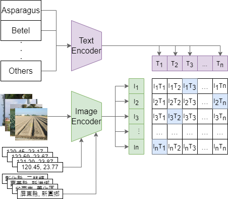

## 農地作物現況調查影像辨識競賽-秋季賽 : AI作物影像判識

## Approach
<div>
    <a align="center" href="https://github.com/jeffzhux/AICUP_fall">
        
    </a>
    <br>
</div>



## Getting Started

### Install
```
git clone https://github.com/jeffzhux/AICUP_fall.git
cd AICUP_FALL
pip install -r requirements.txt
```

### Prepare Data
```
.
└── data
    ├── train
    │   ├── asparagus
    │   │   ├── 000b43a3-d331-47ad-99a4-4c0fa9b48298.jpg
    │   │   ├── 00a326ba-7e9a-4bc1-8684-4bf404bfd6bb.jpg
    │   │   ├── ...
    │   │   └─ 0a550bc0-9b1f-4fa8-81cc-9b518af29c89.jpg
    │   ├── bambooshoots
    │   ├── ...
    │   └── waterbamboo
    ├── valid
    │   ├── asparagus
    │   ├── bambooshoots
    │   ├── ...
    │   └── waterbamboo
    └── tag_locCoor.csv
```

### Pretrained Checkpoints

| Model                                                                                                                | size | epoch | acc   | acc<sup>ema|
|----------------------------------------------------------------------------------------------------------------------|------|-------|-------|------------|
| [Teacher Model-v2s](https://github.com/jeffzhux/AICUP_fall/releases/download/v1.0.0/Teacher_model_epoch_100.pth)     | 224  |  100  | 88.68 | 88.08      |
| [Noise Student-v2s](https://github.com/jeffzhux/AICUP_fall/releases/download/v1.0.0/v2s_noise_student_epoch_100.pth) | 224  |  100  | 88.80 | 88.44      |
| [Noise Student-v2m](https://github.com/jeffzhux/AICUP_fall/releases/download/v1.0.0/v2m_noise_student_epoch_80.pth)  | 224  |   80  | 88.17 | 87.16      |
| [MixMatch-v2s](https://github.com/jeffzhux/AICUP_fall/releases/download/v1.0.0/v2s_mixmatch_epoch_100.pth)           | 224  |  100  | 85.90 | 86.81      |

### Train
* Train Teacher Model (Supervised Learning)
```
python train_noiseStudent.py ./config/noiseStudent_config.py
```

* Train Student Model (Semi-Supervised Learning with Noise Student)
```
python train_noiseStudent.py ./config/noiseStudent_config.py
```

* Train Model (Semi-Supervised Learning with MixMatch)
```
python train_mixmatch.py ./config/mixmatch_config.py
```

### Eval
Evaluating single model performance
```
python test_sim.py ./config/test_sim_config.py
```

